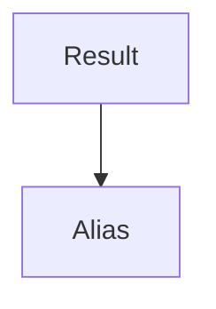

# Result

Service for storing & retrieving game results. All responses in json!

Dependencies



# POST /result

Post a game, which is then stored as individual results. In the example below "team" and "one" gets an entry as winners and the rest are losers.

```json
{
  "teams": [["team", "one"], ["second", "team"], ["etc"]],
  "winner": 0, // the index of the winning team
  "game": "string",
  "matchId": "string"
}
```

# DELETE /result

Deletes a specific entry.

```json
{
  "id": "12-3-4"
}
```

# GET /result/query

Executes custom query. [Query documentation here.](https://firebase.google.com/docs/firestore/query-data/queries)

```json
{
  "args": [["game", "==", "dota 2"], ["id" "==", "1337"]]
}
```

# GET /result/all

Gets all results

```
/* no body */
```

# GET /result ?user=some_person

Query parameter `user`, can be alias or id. Aliases gets converted to id, resulting in slower response times.

```
/* no body */
```
